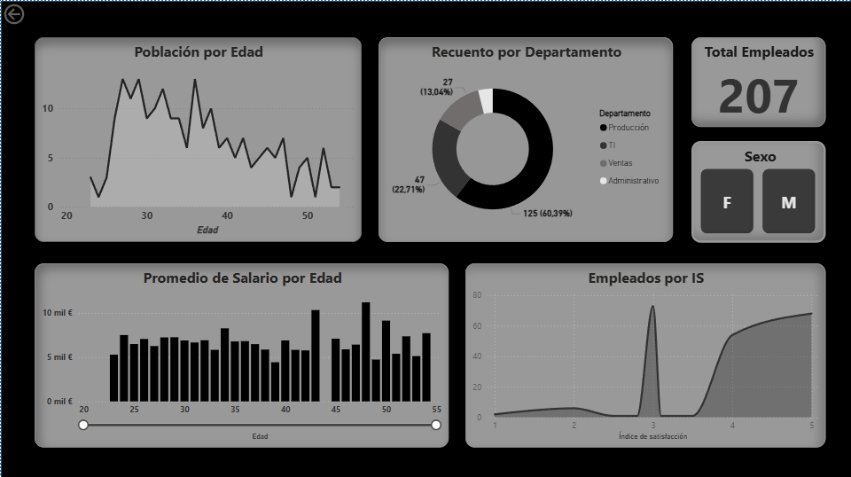
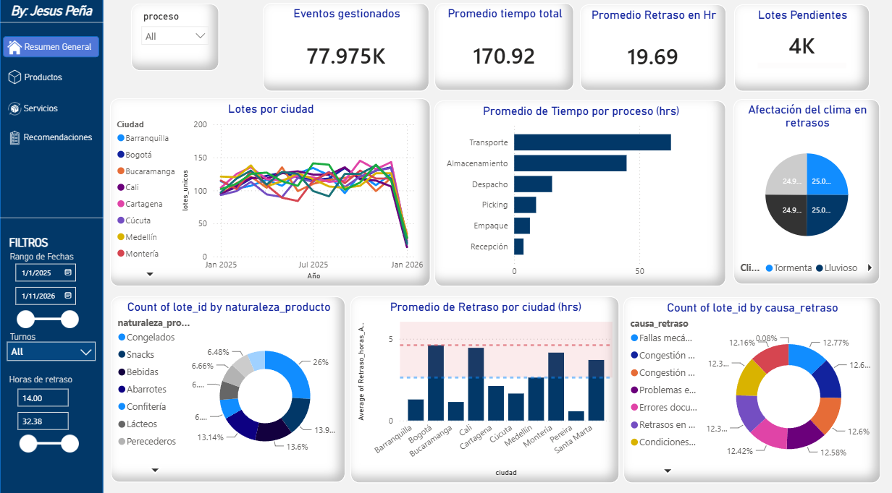
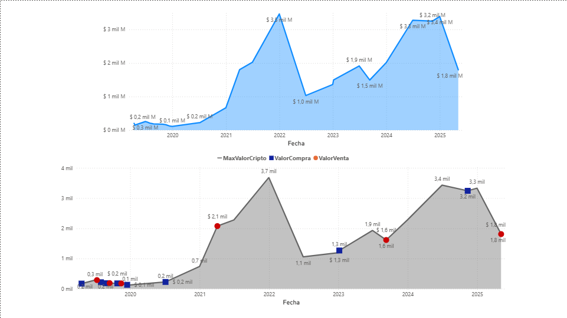

## 👥 1. Dashboard de Analítica de Recursos Humanos (Monitoreo de Empleados)
Análisis demográfico, financiero y de clima organizacional para la gestión estratégica del talento humano en una plantilla de 207 colaboradores.

### 📷 Vista del Dashboard

### 🎯 El Reto de Negocio
Las organizaciones suelen gestionar su personal a ciegas, sin correlacionar factores clave como la edad, el salario y la satisfacción de los empleados. Este cuadro de mando centraliza los datos de la plantilla para identificar brechas salariales, distribución por departamentos y focos de insatisfacción laboral.

### 💡 Análisis e Impacto del Tablero
* **Distribución de Fuerza Laboral**: El gráfico de dona revela una concentración crítica en el departamento de **Producción (60.39%)**, permitiendo a la gerencia entender dónde se ubica la mayor carga operativa.
* **Correlación Salarial**: A través del gráfico de barras e histogramas de edad, se analiza el **Promedio de Salario por Edad**, permitiendo auditar la equidad salarial y diseñar planes de compensación estructurados.
* **Métricas de Clima (Índice de Satisfacción)**: El gráfico de densidad inferior segmenta a los empleados según su nivel de conformidad (IS), sirviendo como un sistema de alerta temprana para prevenir la rotación de personal (Employee Churn).

### 🛠️ Lo que evalúa un reclutador técnico en este proyecto:
* **UI/UX Avanzado (Diseño)**: Implementación de interfaz en modo oscuro con estética minimalista y botones de filtrado rápido ("Sexo: F / M") que mejoran la experiencia del usuario.
* **Modelado y Filtros**: Uso de un segmentador de rango de edad dinámico que filtra todo el reporte en tiempo real.

## 🚚 2. Dashboard de Control Logístico y Gestión de Distribución
Sistema de inteligencia de negocios diseñado para monitorear la cadena de suministro, analizar cuellos de botella en los procesos y auditar las causas raíz de los retrasos operativos.

### 📷 Vista del Dashboard

### 🎯 El Reto de Negocio
En la industria logística, cada hora de retraso se traduce en pérdidas financieras masivas y clientes insatisfechos. Este cuadro de mando fue desarrollado para responder a tres preguntas críticas de la gerencia de operaciones: ¿En qué etapa del proceso estamos perdiendo más tiempo?, ¿Qué ciudades no están cumpliendo con los niveles de servicio (SLA)? y ¿Cuáles son los factores externos que más impactan nuestras entregas?

### 💡 Análisis e Impacto del Tablero
* **Auditoría de Cuellos de Botella**: El análisis revela que el **Transporte y el Almacenamiento** representan las fases con mayor consumo de tiempo operativo (~170.92 hrs en total), permitiendo priorizar inversiones en optimización de rutas y flotas.
* **Análisis de Causa Raíz**: A través de gráficos de dona y diagramas específicos, se correlacionan los retrasos con variables críticas como fallas mecánicas, errores de documentación y la **Afectación del clima** (tormentas y días lluviosos).
* **Control Geográfico del Desempeño**: El gráfico de barras por ciudades incluye una **línea de umbral objetivo** (KPI Target). Esto expone que ciudades como Bogotá, Cali y Montería superan constantemente el límite permitido de horas de retraso.

### 🛠️ Lo que evalúa un reclutador técnico en este proyecto:
* **Estructura de Menú de Navegación**: Diseño de un panel lateral izquierdo que simula una aplicación web corporativa para cambiar entre pestañas (*Resumen, Productos, Servicios, Recomendaciones*).
* **Gestión Avanzada de Filtros**: Inclusión de segmentadores de alta granularidad como rangos de fechas interactivos, turnos de trabajo y selectores numéricos para horas de retraso específicas.

## 🪙 3. Dashboard Financiero: Auditoría y Gestión de Criptoactivos
Análisis macroeconómico e histórico (periodo 2020-2025) diseñado para evaluar la efectividad de las decisiones de inversión mediante el rastreo temporal de órdenes de compra y venta.

### 📷 Vista del Dashboard

### 🎯 El Reto de Negocio
La volatilidad extrema del mercado de criptomonedas hace que evaluar el rendimiento de un portafolio de inversión sea una tarea compleja. Este proyecto se estructuró como un material de auditoría interna para responder a preguntas financieras críticas: ¿Las órdenes de compra y venta se ejecutaron de manera óptima según los ciclos del mercado?, ¿Cuál fue el comportamiento de los activos durante los mercados alcistas (*bull markets*) de 2022 y 2024?

### 💡 Análisis e Impacto del Tablero
* **Monitoreo de Máximos Históricos**: El gráfico superior rastrea dinámicamente los picos de valor de mercado masivo (alcanzando techos analíticos de hasta $3.5 mil M), sirviendo como línea base para contrastar la liquidez global del mercado.
* **Auditoría de Eventos de Ejecución**: El gráfico inferior implementa marcadores condicionales donde se mapean cronológicamente las **órdenes de compra (azul)** y **órdenes de venta (rojo)** sobre la curva de valor real.
* **Evaluación de Rendimiento Operativo**: Esta herramienta visual funciona como material de evaluación de estrategias de inversión, permitiendo al analista financiero juzgar si los eventos de liquidación (puntos rojos) ocurrieron cerca de los picos máximos para maximizar la rentabilidad.

### 🛠️ Lo que evalúa un reclutador técnico en este proyecto:
* **Manejo de Inteligencia de Tiempo (Time Intelligence)**: Modelado correcto de una tabla de dimensiones de calendario (`Date Table`) para sincronizar múltiples métricas financieras complejas en la misma escala temporal.
* **Diseño Orientado al Análisis Financiero**: Visualización dual optimizada para la comparación rápida de tendencias entre volumen macro de mercado y ejecuciones operativas micro a través del tiempo.
